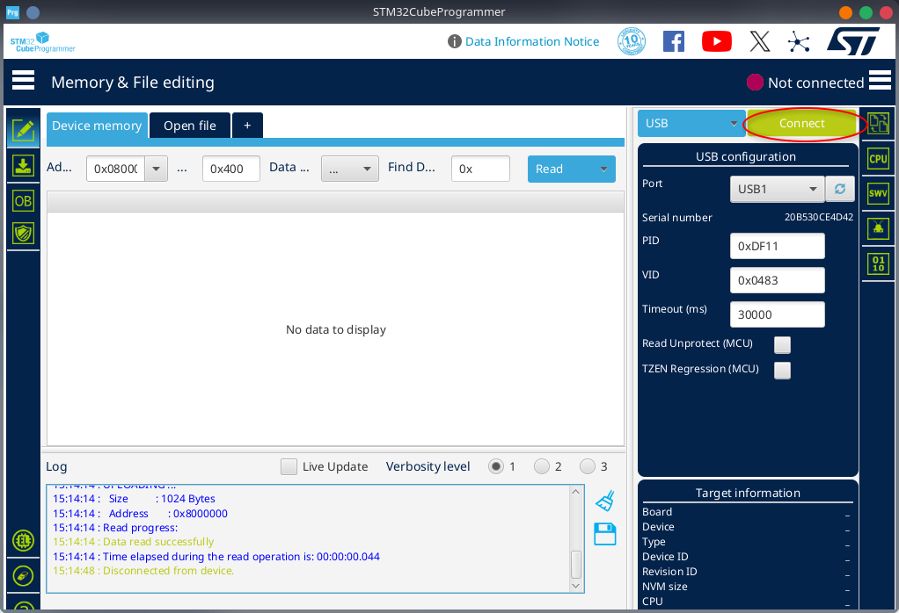
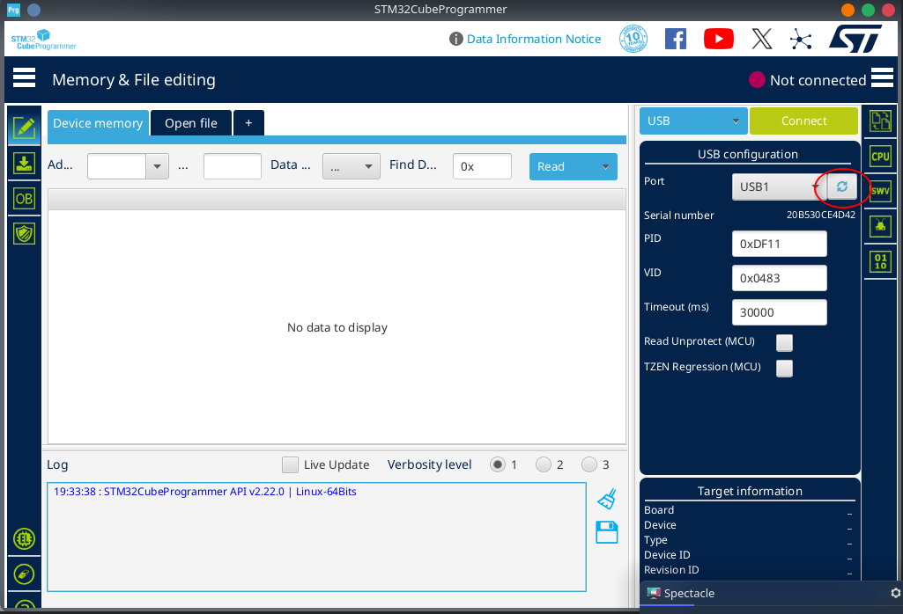
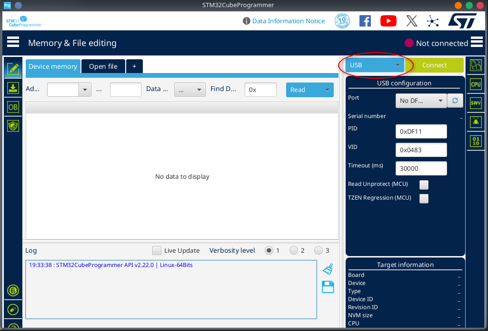
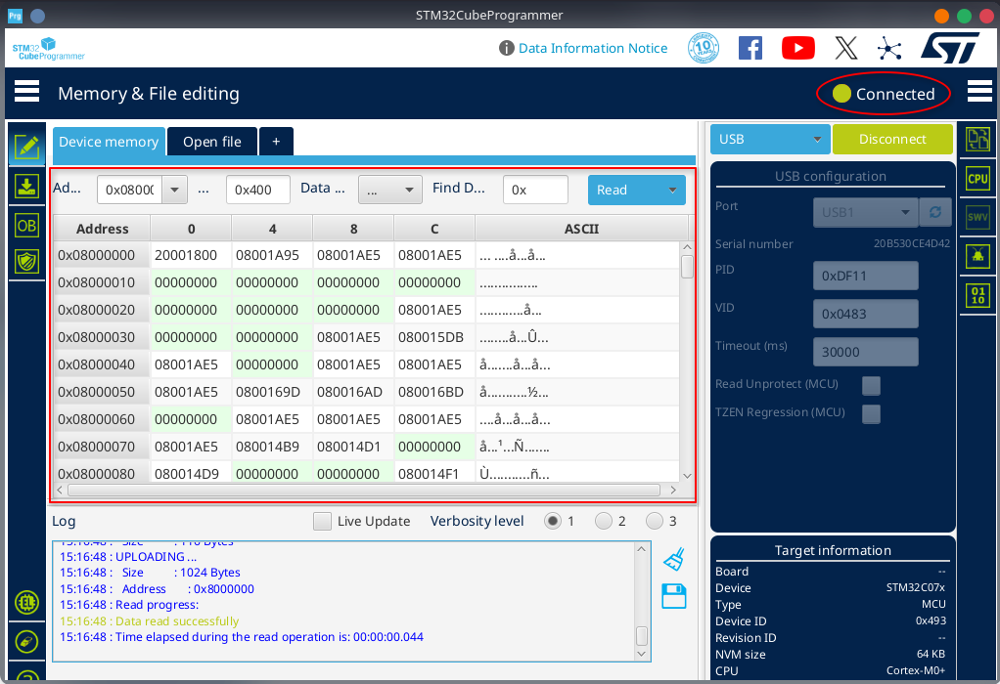
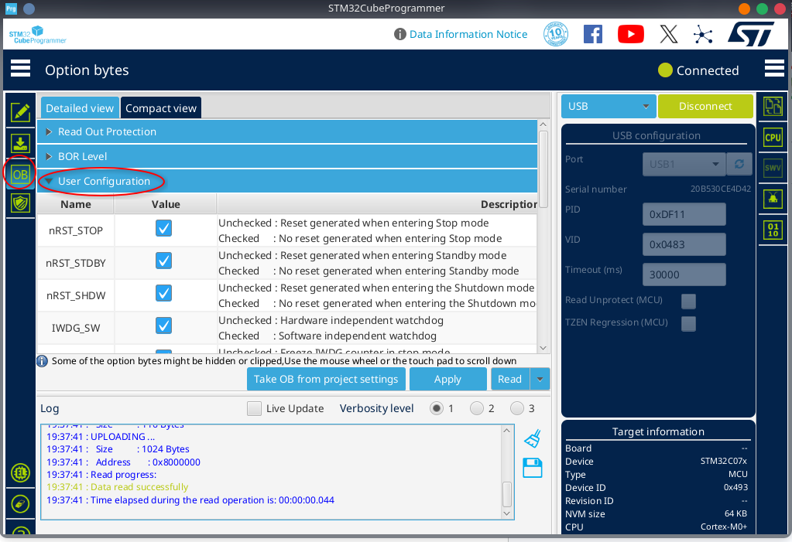
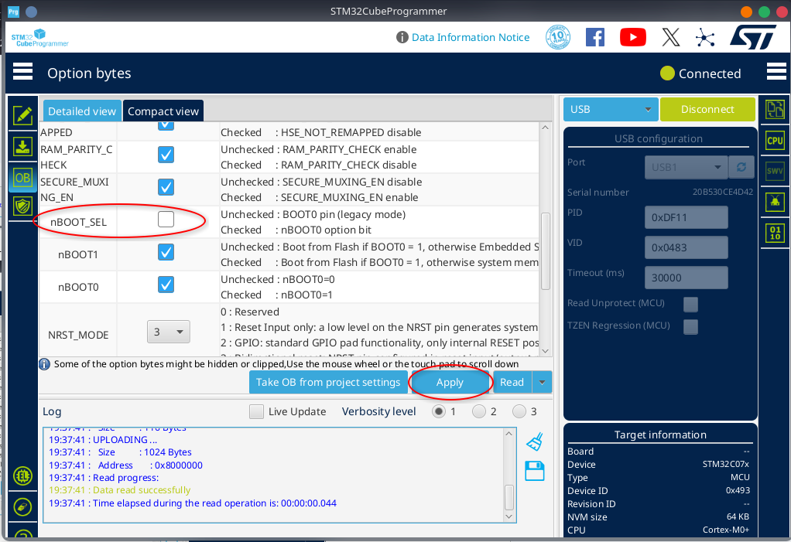

# **Assembly**

1. Solder the SMD parts (USB C connector, and MCU) first, using solder paste

   ***NOTE**: You can use a soldering iron, but it is tricky, make sure to use a fine tip*
   
   ***NOTE**: It is recommended to not solder all of the USB C connector case fins at this step, just lightly solder one of them, that way the connector can be removed easier if you need to resolder it after testing*
   
2. Verify there are no shorts with a multimeter (particularly check between the GND and 5V pins)
3. Solder the 3.3V regulator and diode
4. You now have the minimal required parts for the USB to work, plug the board into a computer to test if it shows up as a USB device. If it does not, you have a short or bad connection somewhere.
5. Solder all remaining components

   ***NOTE**: For the program mode switch, the side that says “ON” points towards the silkscreen text “PRG”.*
   
   ***NOTE**: For the LED, the flat side points toward the square pad.*

# **Setting Option Bits**

1. Setup your MCUs option bits to allow entering USB bootmode after initial programming
   - Plug your breadboard into your computer with a USB-C cable
   - Run STM32CubeProgrammer
   - Select “USB” in the dropdown in the upper right corner

    

2. Click the Port refresh button, the port should auto populate as shown

    

3. Click “Connect”

    

You should see the indicator turn green and say “Connected” and the section on the left should populate with binary data, as shown below.

    

4. Click on “OB” on the left-hand toolbar and open the “User Configuration” dropdown

    

5. Scroll down to “nBOOT\_SEL” and uncheck it; then click “Apply”.

    

