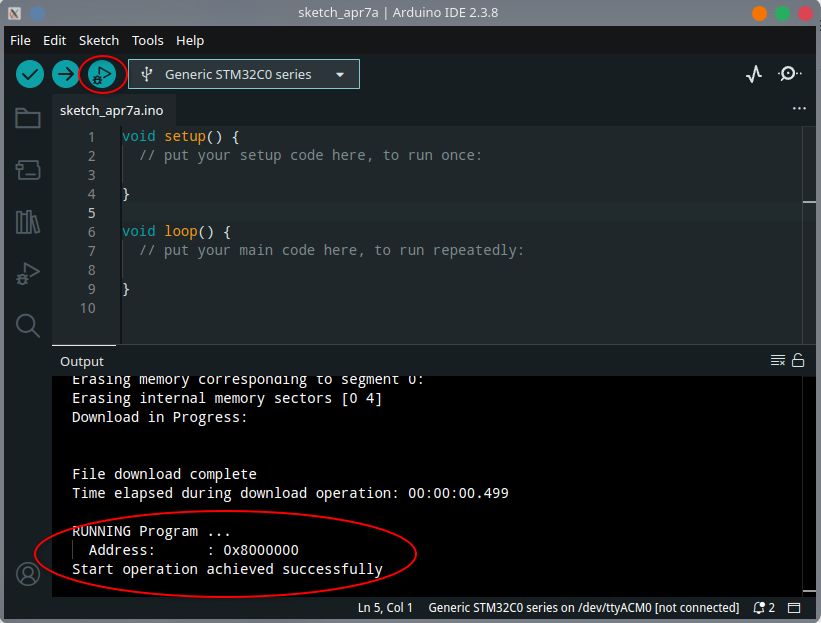
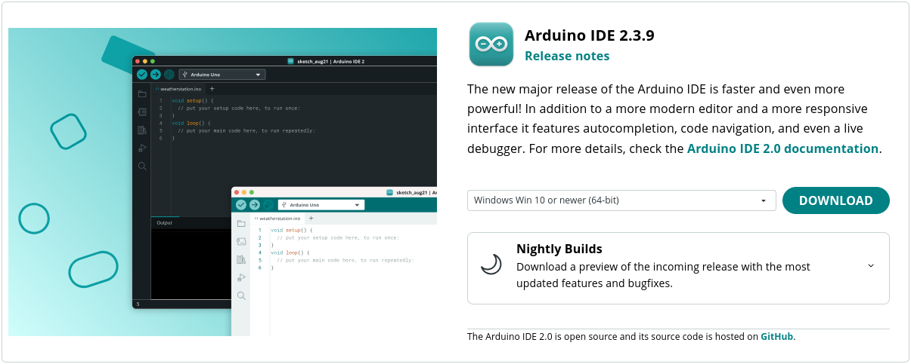
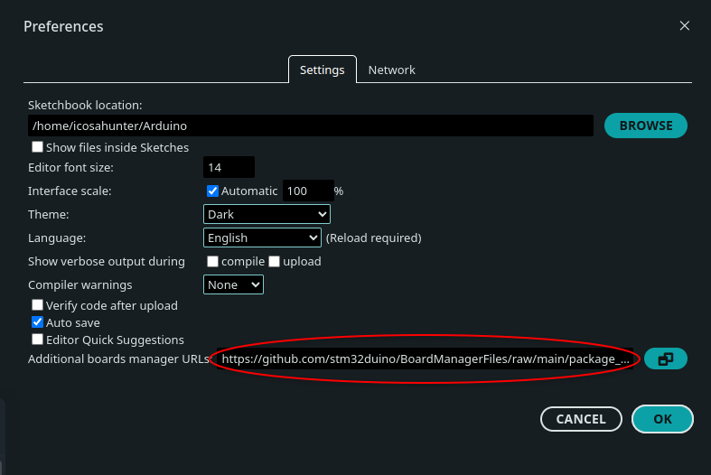
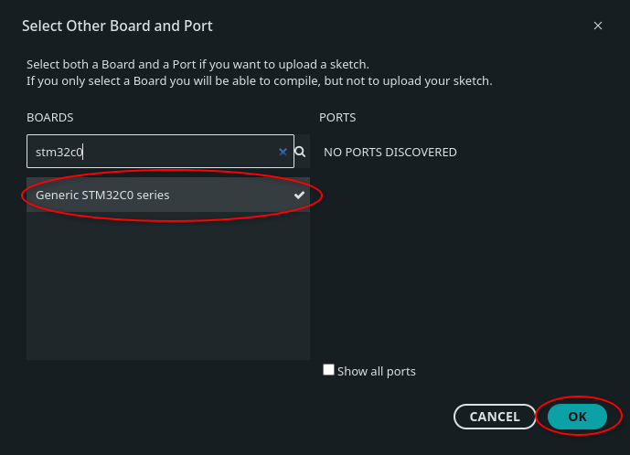
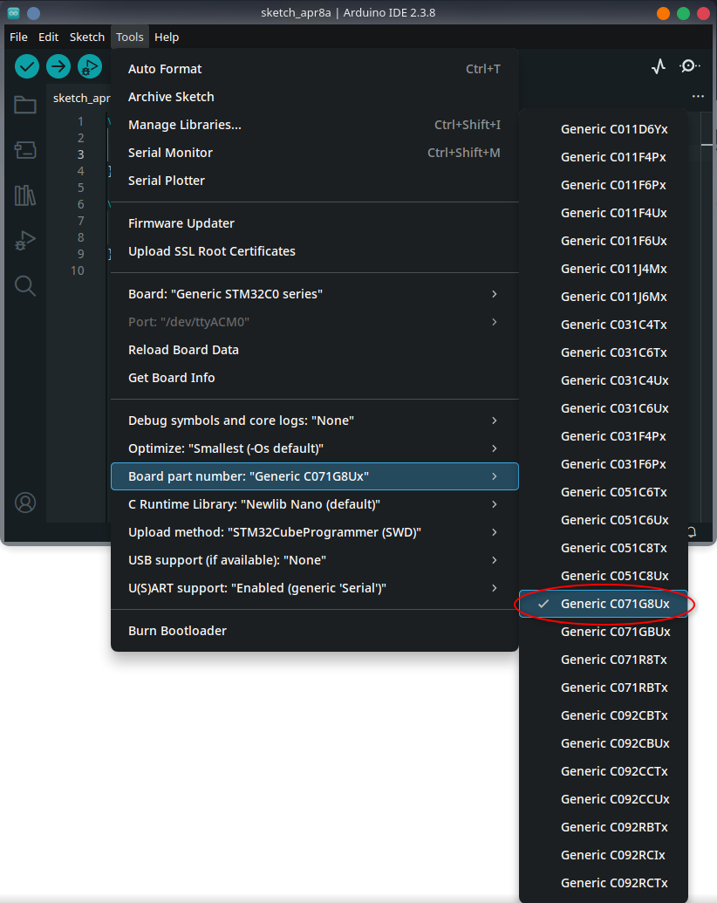
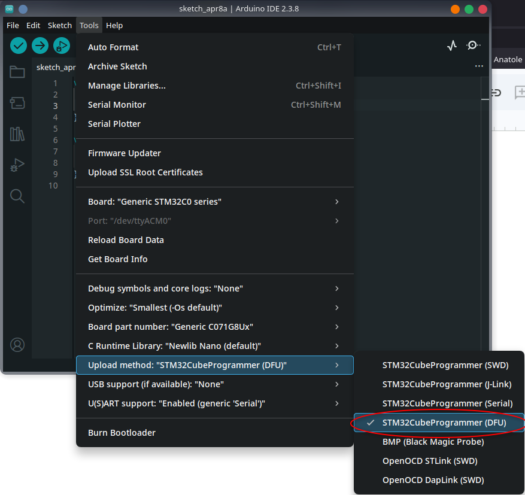

# Basalt Dev Env Setup

## Setup Development Environment

1. Install Arduino IDE

	**Note**: *Arduino IDE may be in your app store / software center, check there first. Otherwise, follow the steps below*

   - Go to Arduino’s software page [here](https://www.arduino.cc/en/software/)
   - Scroll down to the Arduino IDE box
   - Select your OS from the dropdown and click “DOWNLOAD”

    

2. Run the installer
3. Add support for STM32 boards
   - In Arduino IDE, under File / Preferences, add `https://github.com/stm32duino/BoardManagerFiles/raw/main/package\_stmicroelectronics\_index.json` to “Additional boards manager URLs”

    

2. Under Tools / Board / Boards Manager… search for and install “STM32 MCU based boards”

    

3. Install STM32CubeProgrammer
   - Download the appropriate installer for your OS from [here](https://www.st.com/en/development-tools/stm32cubeprog.html#st-get-software)  
   - Follow the install instructions for your OS from the software manual [here](https://www.st.com/resource/en/user_manual/um2237-stm32cubeprogrammer-software-description-stmicroelectronics.pdf)

## Setup a New Arduino Sketch

1. Run Arduino IDE
2. Under File click “New Sketch”
3. Hover over the dropdown next to the run button and click “Select other board and port…”

    

4. In the pop-up search for and select “Generic STM32C0 series” and then click “OK”.

    

5. Under Tools / Board part number: Select “Generic C071G8Ux”

    

6. Under Tools / Upload method: Select “STM32CubeProgrammer (DFU)”

    

7. Save your sketch with Ctrl \+ S

## Upload a Sketch to the Board

1. Open the sketch in Arduino IDE
2. Plug your breadboard into your computer with a USB-C cable
3. Set “PRG SW” to closed position and click “RST BTN” on your breadboard

	**Note**: *If PRG SW is closed, the board will boot into USB DFU mode on a reboot/reset, otherwise it will boot into your program, if there is one.*

4. Your computer should get a notification that a USB device named “STMicroelectronics DFU in FS Mode” has been connected.  
5. Click the “Start Debugging” button. After the upload is complete you should see a success message in the output box and get a notification that the USB device has disconnected.

    

6. Set “PRG SW” to open position
